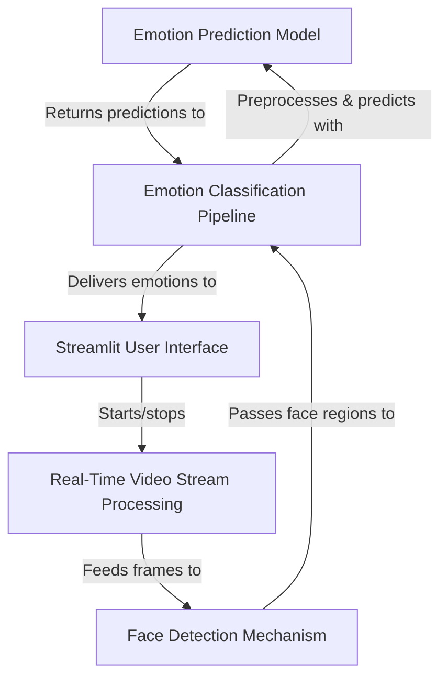
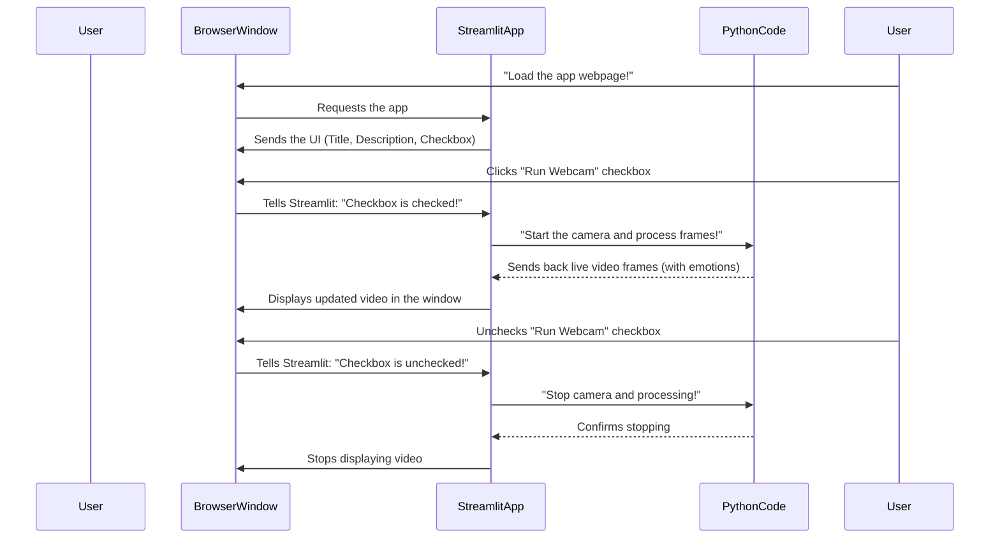
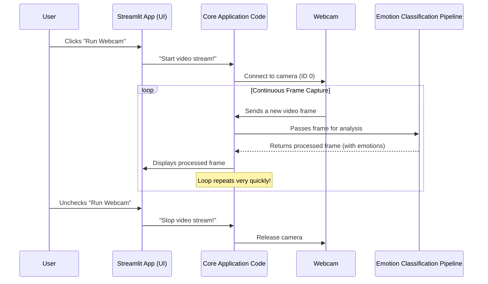
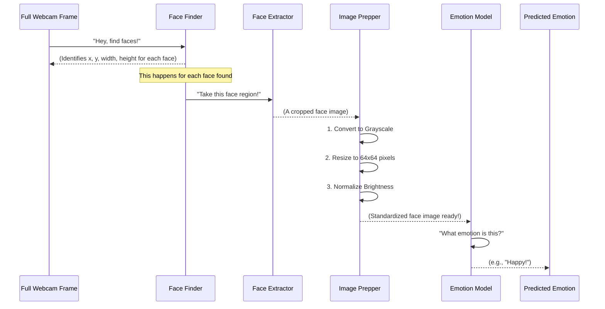
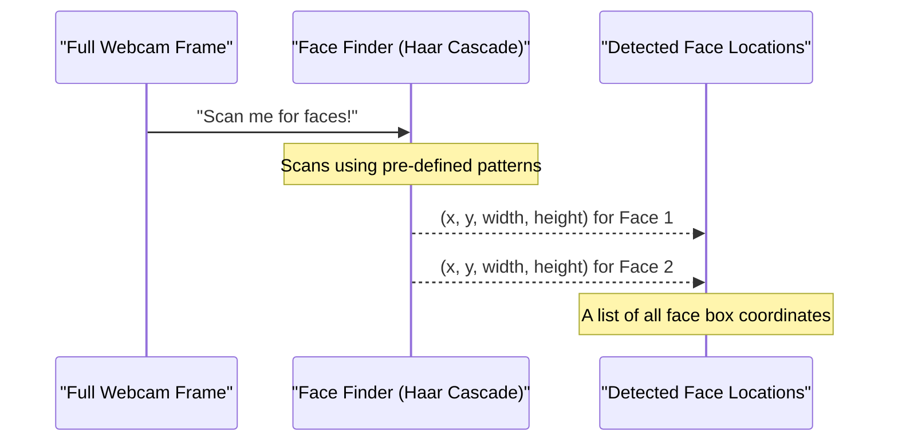
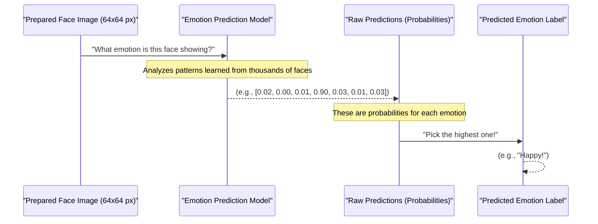

# Tutorial: face-emotion-detection

This project is a *real-time face emotion detection* application that uses your webcam to instantly identify and display emotions like **Happy**, **Sad**, or **Angry** from detected faces. It provides a simple web interface where you can easily start your camera, observe your face being detected, and see the *classified emotions* appearing live on the video feed.


## Visual Overview



## Chapters

1. [Streamlit User Interface
](01_streamlit_user_interface_.md)
2. [Real-Time Video Stream Processing
](02_real_time_video_stream_processing_.md)
3. [Emotion Classification Pipeline
](03_emotion_classification_pipeline_.md)
4. [Face Detection Mechanism
](04_face_detection_mechanism_.md)
5. [Emotion Prediction Model
](05_emotion_prediction_model_.md)

# Chapter 1: Streamlit User Interface

Have you ever used an app on your phone or computer that just *works*? You tap a button, and something happens. You see a live video, or text appears. This friendly way of interacting with an application is called a User Interface, or UI. For our "Face Emotion Detection" project, we need a simple control panel like this so anyone can easily use it to detect emotions.

**The big problem Streamlit solves for us is making a complex Python program easy to use, without needing to know any code.** Imagine you have built a fantastic robot that can see emotions. How would you tell it to start looking, or see what it sees? You'd want a simple screen with buttons and a display, right? That's exactly what Streamlit gives us.

**Our main goal in this chapter is to understand how we can run the emotion detection application directly in our web browser, see a live video from our webcam, and control it with a simple click.**

### What is the Streamlit Control Panel?

Streamlit is a special Python library that helps us build simple web applications quickly. Think of it as a friendly tool that turns your Python code into interactive web pages. Our Streamlit user interface is the **friendly control panel** that lets you interact with the emotion detection application through your web browser.

It provides simple elements like:

1.  **A Title:** The main name of our app at the top.
2.  **Explanatory Text:** A short description of what the app does.
3.  **A "Run Webcam" Checkbox:** A simple on/off switch to start or stop your camera.
4.  **A Dedicated Window:** This is where you'll see the live video feed from your webcam, with emotions detected right on people's faces!

### How to Use Our Streamlit Interface

Using our application is super easy, thanks to Streamlit:

1.  First, you'll start the Streamlit application (we'll cover how to do this later in the overall setup instructions, but it's usually a simple command in your terminal).
2.  Open your web browser (like Chrome, Firefox, or Safari).
3.  Go to the web address that Streamlit tells you (it's usually something like `http://localhost:8501`).
4.  You will immediately see the app's title and a description.
5.  To start detecting emotions, simply **click the "Run Webcam" checkbox**.
6.  Your computer's webcam will turn on, and you'll see a live video of yourself (or whoever is in front of the camera) in the dedicated video window. The app will start drawing boxes around faces and showing the detected emotions!
7.  To stop the webcam and the detection, just **uncheck the "Run Webcam" checkbox**.

It's just like turning on a light switch!

### Under the Hood: How Streamlit Helps Us Interact

Let's look at a simplified sequence of what happens when you interact with the Streamlit app. Imagine Streamlit as a helpful assistant that connects you to the complex Python code doing all the heavy lifting.



**Explanation:** When you open the web page, Streamlit builds the user interface (the title, description, and the checkbox) and shows it in your browser. When you click the "Run Webcam" checkbox, Streamlit acts as a messenger, telling the core Python code to start using the camera and analyzing the video. The Python code then continuously sends the processed video frames (with detected emotions) back to Streamlit, which then updates the display in your browser. This all happens very fast, making it feel like a live, interactive experience!

### Diving into the Code: Building Our UI

Let's peek into the `MyFaceEmotion/FaceDetection.py` file to see how these simple UI elements are created using Streamlit.

First, we need to import the `streamlit` library so we can use its functions:

```python
# MyFaceEmotion/FaceDetection.py
import streamlit as st # Our friendly UI builder
# ... other imports for computer vision and AI
```

The `import streamlit as st` line means we can now use `st.` followed by a Streamlit function to add elements to our web app.

#### Setting the Title and Description

The very first things a user sees are the title and a short explanation.

```python
# MyFaceEmotion/FaceDetection.py
def main():
    st.title("😊 Real-Time Face Emotion Detection")
    st.markdown("Detect emotions (Angry, Happy, Sad, etc.) in real-time from your webcam.")
    # ... rest of the application code
```

*   `st.title("😊 Real-Time Face Emotion Detection")`: This line adds a large, prominent title to our web page. The emoji makes it friendly!
*   `st.markdown(...)`: This lets us add explanatory text. Streamlit understands Markdown formatting (like bold text or headings), which is why it's called `markdown`. It's perfect for describing what the app does.

#### The "Run Webcam" Checkbox

This is our main control for starting and stopping the emotion detection.

```python
# MyFaceEmotion/FaceDetection.py
# ... inside main() function
run = st.checkbox('Run Webcam')
# ... rest of the application code
```

*   `st.checkbox('Run Webcam')`: This simple line creates a clickable checkbox on our web page labeled "Run Webcam".
*   When you click the checkbox, the variable `run` becomes `True`. When you uncheck it, `run` becomes `False`. This `run` variable is then used in a loop to decide if the webcam should be active or not.

#### The Live Video Window

Finally, we need a place to show the live video feed from the webcam.

```python
# MyFaceEmotion/FaceDetection.py
# ... inside main() function
FRAME_WINDOW = st.image([])
# ...
# Later, inside the main processing loop:
# FRAME_WINDOW.image(cv2.cvtColor(frame, cv2.COLOR_BGR2RGB))
```

*   `FRAME_WINDOW = st.image([])`: This creates an empty box on our web page, like a blank TV screen. We store a reference to this box in a variable called `FRAME_WINDOW`.
*   Later, as the application runs, it will constantly update this `FRAME_WINDOW` with new pictures (frames) from the webcam. Each time a new frame is ready, `FRAME_WINDOW.image()` is called to display it, making it look like a smooth, live video.

### Conclusion

In this chapter, you've learned about the "Streamlit User Interface" as the friendly control panel for our emotion detection app. You now understand how simple elements like titles, text, a checkbox, and a video window are used to make the application easy to interact with. Streamlit handles the complexities of web development, allowing us to focus on the fun part: detecting emotions!

Next, we'll dive into how the application actually gets those live video frames from your webcam and prepares them for emotion detection in the chapter: [Real-Time Video Stream Processing](02_real_time_video_stream_processing_.md).

---

# Chapter 2: Real-Time Video Stream Processing

In the previous chapter, we explored the [Streamlit User Interface](01_streamlit_user_interface_.md), which is our friendly control panel for the "Face Emotion Detection" app. You learned how a simple checkbox can start and stop the whole process, and how a dedicated window shows the live video. But how does the app actually *get* that live video? Where do those constantly updating pictures come from?

That's exactly what "Real-Time Video Stream Processing" is all about!

### The Live Broadcast Station for Your Webcam

Imagine our "Face Emotion Detection" application as a TV news station. The [Streamlit User Interface](01_streamlit_user_interface_.md) is the TV screen you watch. But before you can see anything on the screen, there needs to be a camera capturing the event and a system that continuously sends those pictures to the screen.

**The big problem "Real-Time Video Stream Processing" solves is getting a continuous flow of live pictures (called 'frames') from your webcam, one after another, as fast as possible, and making them available for analysis.**

Think of it like this: your webcam is a camera, and "Real-Time Video Stream Processing" is the diligent photographer who never stops taking pictures. As soon as one picture (a "frame") is taken, it's immediately sent off to be analyzed for faces and emotions, and then the photographer takes another picture, and another, and another, all without pausing. This non-stop picture-taking and sending is what makes our app feel "live" or "real-time."

**Our main goal in this chapter is to understand how our application uses your webcam to capture a continuous stream of video and prepares each individual picture (frame) to be analyzed.**

### What is a Video Stream?

When you watch a video, it looks like a smooth moving picture. But secretly, it's just a very fast sequence of individual still pictures, much like a flipbook! Each of these individual pictures is called a **frame**.

*   **Video Stream:** A continuous series of these frames, played one after another very quickly.
*   **Real-Time:** This means everything is happening *now*, with very little delay. As soon as your webcam sees something, it's captured and processed almost instantly.

### How Does Our App Get Live Video?

Our application uses a special library called `OpenCV` (short for Open Source Computer Vision Library). Think of `OpenCV` as a powerful toolbox specifically designed to work with images and videos. It knows how to talk to your webcam, capture frames, and do all sorts of image-related tricks.

Here's the basic process:

1.  **Connect to the Webcam:** The app first establishes a connection to your computer's webcam.
2.  **Start the Loop:** It then enters a continuous loop, which is like saying, "Keep doing this forever (or until I tell you to stop)."
3.  **Capture a Frame:** In each turn of the loop, the app asks the webcam, "Give me the current picture you see!"
4.  **Process the Frame:** Once it gets a picture (a frame), it immediately sends it to the next part of our application: the [Emotion Classification Pipeline](03_emotion_classification_pipeline_.md), which will look for faces and emotions.
5.  **Repeat:** It then goes back to step 3, captures the *next* frame, and sends it for processing. This happens many times a second, making it seem like smooth video.

### Under the Hood: The Continuous Flow

Let's visualize this constant flow of frames. Remember, all of this starts when you click the "Run Webcam" checkbox in the [Streamlit User Interface](01_streamlit_user_interface_.md).



**Explanation:** Once you tell the Streamlit app to run the webcam, our core application code takes over. It connects to your webcam and then gets stuck in a fast loop. In each turn of the loop, it grabs a fresh picture from the webcam, sends it off to be analyzed (which we'll cover in [Emotion Classification Pipeline](03_emotion_classification_pipeline_.md)), and then displays the results back to the [Streamlit User Interface](01_streamlit_user_interface_.md) for you to see. This cycle repeats hundreds of times per minute!

### Diving into the Code: Capturing the Stream

Let's look at the `MyFaceEmotion/FaceDetection.py` file to see how we set up this real-time video stream processing.

First, we need to bring in our camera control tool: `cv2`.

```python
# MyFaceEmotion/FaceDetection.py
import cv2 # Our toolbox for working with cameras and images
# ... other imports
```

Now, let's look at the heart of the video stream processing, found inside our `main()` function:

#### 1. Connecting to the Webcam

The first step is to tell our app to use the webcam.

```python
# MyFaceEmotion/FaceDetection.py
def main():
    # ... UI setup
    run = st.checkbox('Run Webcam') # From Chapter 1
    FRAME_WINDOW = st.image([])    # From Chapter 1

    cap = cv2.VideoCapture(0) # Connect to the default webcam!
    # ... rest of the application code
```

*   `cap = cv2.VideoCapture(0)`: This line is super important!
    *   `cv2.VideoCapture()` is the `OpenCV` function that lets us talk to a camera.
    *   The `0` inside the parentheses tells it to use your **default webcam**. If you had multiple webcams, `1` would be the second one, and so on.
    *   The result is stored in a variable called `cap` (short for "capture"), which is like a remote control for our webcam.

#### 2. The Continuous Loop

Once `run` becomes `True` (because you clicked the checkbox), we enter a loop that keeps capturing frames.

```python
# MyFaceEmotion/FaceDetection.py
    # ... after cap = cv2.VideoCapture(0)
    while run: # Keep doing this as long as the 'Run Webcam' checkbox is checked
        # ... capture and process frames
```

*   `while run:`: This is a standard Python `while` loop. It means, "Keep repeating everything inside this loop *as long as* the variable `run` is `True`." Remember from [Streamlit User Interface](01_streamlit_user_interface_.md) that `run` becomes `True` when you check the box and `False` when you uncheck it.

#### 3. Capturing Each Frame

Inside the loop, we ask the webcam for a picture.

```python
# MyFaceEmotion/FaceDetection.py
    while run:
        ret, frame = cap.read() # Ask the webcam for a new picture!
        if not ret:             # Did we actually get a picture?
            st.error("Could not read frame from webcam.")
            break               # If not, something went wrong, so stop.
        # ... process the frame
```

*   `ret, frame = cap.read()`: This is the magic line that gets a picture!
    *   `cap.read()` tells our webcam remote control (`cap`) to "read" the next available frame.
    *   It returns two things:
        *   `ret`: A `True` or `False` value. `True` means "yes, I successfully got a frame." `False` means "something went wrong, no frame."
        *   `frame`: This is the actual picture (the video frame) itself! It's stored as a special kind of data that `OpenCV` understands.
*   `if not ret: ...`: This is a safety check. If `ret` is `False` (meaning `not ret` is `True`), it means the webcam couldn't give us a frame (maybe it's busy, or disconnected). In that case, we show an error and `break` out of the `while` loop to stop the program gracefully.

#### 4. Handing Off the Frame

After capturing a frame, our video stream processing job is to give it to the next step: the emotion detection.

```python
# MyFaceEmotion/FaceDetection.py
        # ... after ret, frame = cap.read()
        results = detect_emotion(frame) # Send the frame to our emotion detection logic
        # ... draw rectangles and emotions onto the frame
```

*   `results = detect_emotion(frame)`: This line takes the `frame` we just captured and passes it directly to the `detect_emotion` function. This function (which we'll explore in detail in the [Emotion Classification Pipeline](03_emotion_classification_pipeline_.md) chapter) will do all the heavy lifting of finding faces and predicting emotions. It then returns the `results` (where faces are and what emotions were detected).

#### 5. Displaying the Frame (Back to Streamlit)

After the frame has been processed (emotions drawn on it), we send it back to Streamlit to display.

```python
# MyFaceEmotion/FaceDetection.py
        # ... after results = detect_emotion(frame)
        # For example, let's say after processing, our 'frame' now has boxes and labels:
        # for (x, y, w, h, emotion) in results:
        #     cv2.rectangle(frame, (x, y), (x+w, y+h), (255, 0, 0), 2)
        #     cv2.putText(frame, emotion, (x, y-10), ... )

        FRAME_WINDOW.image(cv2.cvtColor(frame, cv2.COLOR_BGR2RGB))
```

*   `FRAME_WINDOW.image(...)`: Remember `FRAME_WINDOW` from [Streamlit User Interface](01_streamlit_user_interface_.md)? This is where we update it with the *newest* processed `frame`.
*   `cv2.cvtColor(frame, cv2.COLOR_BGR2RGB)`: `OpenCV` usually handles colors in a BGR (Blue, Green, Red) order, but most other systems (like Streamlit) prefer RGB (Red, Green, Blue). This line simply rearranges the color channels so the picture looks correct when displayed!

#### 6. Cleaning Up

What happens when you uncheck the "Run Webcam" checkbox? The `while run:` loop stops. But we still need to properly disconnect from the webcam.

```python
# MyFaceEmotion/FaceDetection.py
    # ... after the while run: loop ends
    cap.release() # Release the webcam so other programs can use it
```

*   `cap.release()`: This is very important! It tells the webcam to stop sending frames and frees up the camera so other applications can use it. It's like properly closing a file after you're done editing it.

### Conclusion

You've now seen how "Real-Time Video Stream Processing" acts as the eyes of our emotion detection application! It's the mechanism that continuously grabs fresh pictures from your webcam, ensuring that our app always has the latest visual information to work with. We use `OpenCV` to connect to the camera, capture frames in a fast loop, and then hand them off for analysis, and finally, display them back to the user.

This constant, fast flow of images is the foundation for a truly dynamic and interactive experience. Next, we'll follow those captured frames into the heart of the analysis: the [Emotion Classification Pipeline](03_emotion_classification_pipeline_.md).

---

# Chapter 3: Emotion Classification Pipeline

In the previous chapter, [Real-Time Video Stream Processing](02_real_time_video_stream_processing_.md), you learned how our application continuously captures live pictures (frames) from your webcam. This ensures we always have fresh visual information. But what happens *after* we get a frame, and *before* we can tell if someone is happy or sad?

Imagine you're trying to bake a cake. You have all the ingredients (eggs, flour, sugar), but you can't just dump them all into a bowl! You need to crack the eggs, measure the flour, and perhaps sift it. Each ingredient needs to be prepared *just right* before it can go into the final mix.

**The big problem the "Emotion Classification Pipeline" solves is preparing a detected face in a standardized way so that our "emotion prediction model" (the "chef" in our analogy) can accurately understand its emotion.** A raw image of a face from the camera is like an unprepared ingredient; it's not ready for our AI model to "eat" and understand.

**Our main goal in this chapter is to understand the step-by-step process, like an assembly line, that takes a simple picture of a face and gets it perfectly ready for emotion detection.**

### What is the Emotion Classification Pipeline?

Think of the Emotion Classification Pipeline as a special "prep kitchen" for faces. Once the application spots a face in the video (we'll cover *how* it finds faces in [Face Detection Mechanism](04_face_detection_mechanism_.md)), this pipeline takes over. It's a series of crucial steps that transform a raw face image into a clean, standardized format that our AI model can easily understand.

Here are the key steps in our pipeline:

1.  **Extract the Face:** First, we cut out *only* the face from the larger video frame.
2.  **Convert to Grayscale:** We turn the color face image into black and white.
3.  **Resize to Standard Size (64x64 pixels):** We make sure every face image is exactly the same size.
4.  **Normalize Brightness:** We adjust the brightness of the image to a consistent level.

Why do all this? Our [Emotion Prediction Model](05_emotion_prediction_model_.md) is like a very picky chef. It expects its ingredients (face images) to be in a very specific, consistent format. If we don't prepare them correctly, the model won't work well!

### How Our App Uses the Pipeline

Our application runs this pipeline automatically for every face it finds in each video frame. You don't directly "call" the pipeline steps one-by-one; instead, they are all bundled together inside a function called `detect_emotion`.

When you click "Run Webcam" in our [Streamlit User Interface](01_streamlit_user_interface_.md):
*   The app gets a video frame (from [Real-Time Video Stream Processing](02_real_time_video_stream_processing_.md)).
*   It then calls the `detect_emotion(frame)` function.
*   *Inside* this function, for every face found, the Emotion Classification Pipeline works its magic to prepare the face image.
*   Finally, the prepared face image is sent to the [Emotion Prediction Model](05_emotion_prediction_model_.md) to identify the emotion.

**Input:** A raw, full-color video frame from the webcam.
**Output:** A list of detected faces, each with its position on the screen and its predicted emotion (e.g., Happy, Sad).

### Under the Hood: The Face Prep Assembly Line

Let's trace what happens to a single detected face as it goes through our pipeline.



**Explanation:**
1.  The `Face Finder` (which we'll cover in [Face Detection Mechanism](04_face_detection_mechanism_.md)) identifies where a face is within the large `Webcam Frame`.
2.  For *each* face found, the `Face Extractor` cuts out just that rectangular area.
3.  This cropped face then goes to the `Image Prepper`. Here, it's transformed step-by-step:
    *   It loses its colors and becomes black and white (grayscale).
    *   It's stretched or shrunk to exactly 64x64 pixels.
    *   Its brightness levels are adjusted to be consistent.
4.  Finally, this perfectly prepared image is handed to the `Emotion Model` for the actual prediction.
5.  The `Emotion Model` then tells us the `Predicted Emotion`.

### Diving into the Code: Preparing the Face

Let's look at the `detect_emotion` function in `MyFaceEmotion/FaceDetection.py` to see these steps in action.

First, we get the whole frame and convert it to grayscale. This is a common first step for many image processing tasks because it simplifies the image, focusing on shapes and textures rather than colors.

```python
# MyFaceEmotion/FaceDetection.py

# ... inside detect_emotion(frame) function ...
    gray = cv2.cvtColor(frame, cv2.COLOR_BGR2GRAY) # Convert the whole frame to grayscale
    # ... find faces using face_cascade on 'gray' image ...
```

*   `cv2.cvtColor(frame, cv2.COLOR_BGR2GRAY)`: This `OpenCV` function converts our `frame` (which is typically BGR color from the webcam) into a `GRAYSCALE` image. The result is stored in `gray`.

Next, once a face is detected (the `for (x, y, w, h) in faces:` loop indicates we're processing *each* detected face), we extract just that face region from the grayscale image.

```python
# MyFaceEmotion/FaceDetection.py

# ... inside the for (x, y, w, h) in faces: loop ...
        roi_gray = gray[y:y+h, x:x+w] # Extract the "Region of Interest" (the face)
        # ... more processing steps
```

*   `roi_gray = gray[y:y+h, x:x+w]`: This is how we "crop" the image! `y:y+h` selects the rows (height) and `x:x+w` selects the columns (width) that make up the detected face rectangle. `roi_gray` now holds *only* the grayscale image of that specific face.

Then, this extracted face image needs to be resized to a standard 64x64 pixels. This is a crucial step because our [Emotion Prediction Model](05_emotion_prediction_model_.md) has been trained on images of exactly this size and expects them as input.

```python
# MyFaceEmotion/FaceDetection.py

# ... after extracting roi_gray ...
        roi_gray = cv2.resize(roi_gray, (64, 64)) # Resize to 64x64 pixels
        # ... more processing steps
```

*   `cv2.resize(roi_gray, (64, 64))`: This `OpenCV` function takes our `roi_gray` (the cropped grayscale face) and resizes it to a perfect `64` pixels wide by `64` pixels high.

Finally, we adjust the brightness and add a couple of extra dimensions.
*   **Brightness Normalization:** `roi.astype('float32') / 255.0` converts the pixel values (which typically range from 0 to 255) into a smaller range (0.0 to 1.0). This makes the model less sensitive to slight changes in lighting.
*   **Adding Dimensions:** The `np.expand_dims` lines are a bit technical but essentially add extra "empty" layers to the image data. Our [Emotion Prediction Model](05_emotion_prediction_model_.md) expects images to come in a specific "shape" or "format" (like a neatly packaged box), and these lines ensure the image has the correct number of dimensions (e.g., it expects `[1, 64, 64, 1]` for a single 64x64 grayscale image with a 'channel' dimension).

```python
# MyFaceEmotion/FaceDetection.py

# ... after resizing roi_gray ...
        roi = roi_gray.astype('float32') / 255.0 # Normalize brightness (0 to 1)
        roi = np.expand_dims(roi, axis=-1)       # Add a 'channel' dimension
        roi = np.expand_dims(roi, axis=0)        # Add a 'batch' dimension
        # ... now 'roi' is ready for the emotion model
```

*   `roi = roi_gray.astype('float32') / 255.0`: Converts the image data type and scales pixel values from 0-255 to 0.0-1.0. This is called normalization.
*   `roi = np.expand_dims(roi, axis=-1)`: Adds a dimension for the color channel (since it's grayscale, it has 1 channel).
*   `roi = np.expand_dims(roi, axis=0)`: Adds a dimension for the "batch size" (our model is designed to process multiple images at once, even if we're only sending one).

After all these steps, the `roi` variable now holds a perfectly prepared face image, ready to be fed into our `emotion_model.predict()` function (which belongs to the [Emotion Prediction Model](05_emotion_prediction_model_.md) chapter).

### Conclusion

You've now uncovered the "prep kitchen" of our emotion detection application: the Emotion Classification Pipeline. This crucial set of steps ensures that every face detected is uniformly prepared – extracted, desaturated to grayscale, resized to a standard 64x64 pixels, and normalized for brightness – before it reaches our intelligent [Emotion Prediction Model](05_emotion_prediction_model_.md). This standardization is key for accurate emotion analysis.

Next, we'll step back one stage in our overall process and explore *how* our application first spots those faces in the wild, which is the job of the [Face Detection Mechanism](04_face_detection_mechanism_.md).

---
# Chapter 4: Face Detection Mechanism

In the previous chapter, [Emotion Classification Pipeline](03_emotion_classification_pipeline_.md), you learned about the "prep kitchen" that takes a raw face image and gets it perfectly ready for emotion analysis. But before we can even *prepare* a face, our application needs to know one crucial thing: **Where *is* the face in the first place?**

Imagine you're at a crowded party, and you're trying to find your friend. You wouldn't just look at the whole room and guess their emotion, would you? First, you'd scan the room, locate your friend's face, and *then* you'd look at their expression.

**The big problem the "Face Detection Mechanism" solves is pinpointing the exact location of human faces within a video stream or image.** Our emotion detection app can't analyze emotions if it doesn't know *where* the faces are! This component acts like a special "face-finding detective," drawing a precise box around every face it discovers. It doesn't care if the person is happy or sad; its only job is to say, "Aha! There's a face here!"

**Our main goal in this chapter is to understand how our application quickly and accurately spots human faces in a live video feed, marking them with a clear box, ready for the next step of emotion analysis.**

### What is the "Face Finder" Tool?

Think of the "Face Detection Mechanism" as a specialized **"face finder"** tool built into our application. It's incredibly fast and efficient at its single purpose: identifying human faces.

Here's what it does:

1.  **Scans:** It continuously scans the incoming video frames from your webcam (or a single image).
2.  **Locates:** For every face it finds, it determines its exact position.
3.  **Marks:** It then draws a rectangular "bounding box" around each detected face.

This component is like a special pair of glasses that highlights *only* the faces, ignoring everything else in the background.

#### How Does it Recognize a Face? (Haar Cascades)

Our "face finder" tool uses a clever technique called **Haar Cascades**. Don't let the fancy name scare you! You can think of Haar Cascades as a set of pre-defined "sketch patterns" or "checklists" for what a typical human face looks like.

*   **Mini-Patterns:** These patterns look for basic facial features: for example, an area that's darker than its surroundings (like eyebrows), or an area that's lighter (like the bridge of a nose).
*   **Cascading Checks:** The system performs a series of very quick checks. It first looks for a very general "face-like" pattern. If that passes, it moves to a slightly more detailed check (e.g., "Are there two eye-like regions?"). If that passes, it goes to an even more detailed check, and so on. This "cascading" (like a waterfall of checks) allows it to quickly discard areas that clearly aren't faces, saving time.
*   **General Features Only:** These Haar Cascades are designed to recognize *general* facial structures, like the presence of eyes, a nose, and a mouth in the right arrangement. They don't analyze wrinkles or smiles, which are key for emotions. That's the job of the [Emotion Prediction Model](05_emotion_prediction_model_.md).

### How Our App Uses the Face Detection Mechanism

The "Face Detection Mechanism" is the very first step in processing a frame after it's captured by the webcam. It's built right into our `detect_emotion` function.

Here's the simplified flow when you click "Run Webcam":

1.  Your webcam sends a new video frame (thanks to [Real-Time Video Stream Processing](02_real_time_video_stream_processing_.md)).
2.  This frame is passed to our main analysis function, `detect_emotion`.
3.  *Inside* `detect_emotion`, the "Face Detection Mechanism" kicks in:
    *   It quickly scans the entire frame for faces.
    *   For every face it finds, it notes down its position (the `x`, `y` coordinates of the top-left corner, and its `width` and `height`).
4.  These face locations are then passed to the [Emotion Classification Pipeline](03_emotion_classification_pipeline_.md) to prepare each individual face for emotion prediction.

**Input:** A raw, full-color video frame.
**Output:** A list of coordinates (`x, y, w, h`) for every face found in that frame.

### Under the Hood: The Face Finder at Work

Let's visualize the journey of a single video frame as our "Face Finder" scans it for faces.



**Explanation:**
1.  A fresh `Full Webcam Frame` arrives.
2.  It's handed to the `Face Finder`.
3.  The `Face Finder`, using its `Haar Cascade` "sketch patterns," rapidly scans the entire frame. It's looking for areas that match its "face checklist."
4.  Every time it finds an area that strongly matches a face pattern, it records its exact position and size.
5.  Finally, it gives back `Detected Face Locations` – a list of all the faces it found, each described by a rectangle (`x, y, width, height`). This list is then used by the [Emotion Classification Pipeline](03_emotion_classification_pipeline_.md).

### Diving into the Code: Spotting the Faces

Let's look at the `MyFaceEmotion/FaceDetection.py` file to see how we implement this "Face Detection Mechanism."

First, we need to load our "face finding expert" (the Haar Cascade file). This happens only once when the application starts.

```python
# MyFaceEmotion/FaceDetection.py
import cv2 # Our toolbox for working with cameras and images
# ... other imports

# Load Haar Cascade for face detection
face_cascade = cv2.CascadeClassifier(cv2.data.haarcascades + 'haarcascade_frontalface_default.xml')
```

*   `import cv2`: This line brings in our `OpenCV` library, which contains the tools for face detection.
*   `face_cascade = cv2.CascadeClassifier(...)`: This line creates our "face finding expert." It loads a special XML file (`haarcascade_frontalface_default.xml`) that contains all the predefined Haar Cascade patterns for detecting frontal human faces. Now, `face_cascade` is ready to do its job!

Next, inside our `detect_emotion` function, we take the incoming video `frame` and prepare it for face detection. Remember from [Emotion Classification Pipeline](03_emotion_classification_pipeline_.md) that it's often more efficient to work with grayscale images for tasks like face detection.

```python
# MyFaceEmotion/FaceDetection.py

# ... inside detect_emotion(frame) function ...
    gray = cv2.cvtColor(frame, cv2.COLOR_BGR2GRAY) # Convert the whole frame to grayscale
    # ... now we find faces on this 'gray' image ...
```

*   `gray = cv2.cvtColor(frame, cv2.COLOR_BGR2GRAY)`: This converts the colorful `frame` into a simpler `gray` (black and white) image. The face detection algorithm often works faster and more reliably on grayscale images because it doesn't need to worry about color variations, only brightness differences.

Now, for the core action: telling our `face_cascade` expert to find the faces!

```python
# MyFaceEmotion/FaceDetection.py

# ... after converting to grayscale ...
    # Find faces in the grayscale image
    faces = face_cascade.detectMultiScale(gray, 1.3, 5)
    results = [] # Prepare a list to store face details
    # ... loop through each found face ...
```

*   `faces = face_cascade.detectMultiScale(gray, 1.3, 5)`: This is the magic line that actually finds the faces!
    *   `face_cascade.detectMultiScale()` is the method we call on our "face finding expert."
    *   `gray`: This is the grayscale image it should scan.
    *   `1.3`: This is a "scale factor." It tells the algorithm to look for faces of different sizes. A value of `1.3` means it shrinks the image by 30% repeatedly to find faces that might be smaller or larger.
    *   `5`: This is `minNeighbors`. It's like saying, "For something to be considered a face, it needs to be detected by at least 5 different patterns or 'neighbors' in the cascade." This helps reduce false positives (mistaking something that isn't a face for a face).
*   The `faces` variable will now contain a list of tuples. Each tuple represents a detected face and has four numbers: `(x, y, w, h)`.

Finally, we loop through the `faces` list to process each detected face individually.

```python
# MyFaceEmotion/FaceDetection.py

# ... after faces = face_cascade.detectMultiScale(...)
    for (x, y, w, h) in faces:
        # x, y are the top-left corner coordinates of the face rectangle
        # w is the width of the face rectangle
        # h is the height of the face rectangle
        #
        # Now we know exactly where each face is!
        # The next step is to extract and prepare this face (Chapter 3)
        roi_gray = gray[y:y+h, x:x+w] # This is where we crop the face!
        # ... rest of the emotion classification pipeline steps ...
```

*   `for (x, y, w, h) in faces:`: This loop goes through each detected face. For every face, it gives us its coordinates:
    *   `x`: The horizontal position of the top-left corner of the face.
    *   `y`: The vertical position of the top-left corner of the face.
    *   `w`: The width of the face rectangle.
    *   `h`: The height of the face rectangle.
*   Once we have these `(x, y, w, h)` coordinates, we can accurately draw a rectangle around the face (`cv2.rectangle` later in `main()`) and, more importantly, extract just that face region (`roi_gray = gray[y:y+h, x:x+w]`) to pass to the [Emotion Classification Pipeline](03_emotion_classification_pipeline_.md).

### Conclusion

You've now understood the crucial role of the "Face Detection Mechanism" in our emotion detection application. It's the diligent "face finder" that tirelessly scans every incoming video frame, precisely locating and marking human faces using sophisticated Haar Cascade patterns. By doing so, it provides the essential first step, giving the exact coordinates of faces to the [Emotion Classification Pipeline](03_emotion_classification_pipeline_.md) for further processing. This mechanism focuses solely on *where* the faces are, not *what* emotions they're expressing.

With faces now reliably found and prepared, we're ready for the most exciting part: understanding the actual feelings! Next, we'll dive into the brain of our operation in the chapter: [Emotion Prediction Model](05_emotion_prediction_model_.md).

---
# Chapter 5: Emotion Prediction Model

In the previous chapter, [Face Detection Mechanism](04_face_detection_mechanism_.md), you learned how our application smartly finds faces in a video stream. Then, in the [Emotion Classification Pipeline](03_emotion_classification_pipeline_.md), you saw how each detected face is carefully prepared – cropped, converted to grayscale, resized, and normalized – becoming a perfectly shaped "input ingredient." Now, with a perfectly prepared face, we're ready for the most exciting part: understanding its feelings!

Imagine you've given a highly trained art critic a perfectly framed and lit photograph. The critic doesn't just see pixels; they see the style, the brushstrokes, the mood. Similarly, our application needs an "expert critic" to look at that prepared face and tell us, "Aha! That's a 'Happy' face!"

**The big problem the "Emotion Prediction Model" solves is taking a standardized image of a face and accurately determining which emotion it represents.** This is the "brain" of our entire system, the artificial intelligence (AI) expert that has learned to recognize the subtle cues of human emotions. Without it, all the face finding and preparation would be meaningless!

**Our main goal in this chapter is to understand what this "Emotion Prediction Model" is, how it makes its predictions, and how our application uses it to identify feelings like "Happy," "Sad," or "Angry."**

### What is the Emotion Prediction Model?

Think of the "Emotion Prediction Model" as a highly experienced **emotion judge**. It's not a human, but a piece of artificial intelligence that has studied thousands and thousands of pictures of faces, each labeled with its true emotion (e.g., "This face is Happy," "That face is Sad").

*   **Pre-trained Expert:** Our model is already "pre-trained." This means it's like a doctor who has completed all their schooling and residency; it's already learned from countless examples before it even joined our project. We don't need to teach it from scratch!
*   **Pattern Recognizer:** When it sees a new face, it doesn't see individual pixels. Instead, it looks for patterns it has learned: the shape of the mouth, the furrow of eyebrows, the crinkling around eyes. These patterns collectively suggest an emotion.
*   **Outputs Probabilities:** When you show it a face, it doesn't just blurt out an emotion. Instead, it gives you a list of probabilities (like percentages) for *each* emotion it knows. For example, it might say: "Happy: 90%, Neutral: 5%, Sad: 3%, Angry: 2%." The highest percentage is usually the predicted emotion.

This model is a type of **Neural Network**, which is a powerful AI technique inspired by the human brain's structure. It's incredibly good at learning complex patterns from data.

### How Our App Uses the Emotion Prediction Model

The Emotion Prediction Model is the final step in our `detect_emotion` function. Once a face has been captured, detected, and perfectly prepared by the [Emotion Classification Pipeline](03_emotion_classification_pipeline_.md), it's handed over to this model.

Here's the simplified flow for a single face:

1.  A video frame is captured ([Real-Time Video Stream Processing](02_real_time_video_stream_processing_.md)).
2.  Faces are detected within the frame ([Face Detection Mechanism](04_face_detection_mechanism_.md)).
3.  For each detected face, it goes through the [Emotion Classification Pipeline](03_emotion_classification_pipeline_.md) to become a standardized, 64x64 pixel grayscale image.
4.  This *prepared face image* is then fed into our **Emotion Prediction Model**.
5.  The model processes the image and outputs its best guess for the emotion (e.g., "Happy").
6.  This predicted emotion is then displayed on the screen next to the face.

**Input:** A standardized 64x64 grayscale face image (ready from the [Emotion Classification Pipeline](03_emotion_classification_pipeline_.md)).
**Output:** The predicted emotion label (e.g., "Happy," "Sad," "Angry").

### Under the Hood: The Expert's Judgment

Let's visualize how the prepared face is given to our "Emotion Prediction Model" and how it provides its judgment.



**Explanation:**
1.  The `Prepared Face Image` (which came from the [Emotion Classification Pipeline](03_emotion_classification_pipeline_.md)) is given to the `Emotion Prediction Model`.
2.  The `Emotion Prediction Model` uses its vast learned experience to analyze the subtle visual patterns in the face.
3.  It then outputs `Raw Predictions` – a list of numbers, where each number represents the model's confidence (a probability) that the face belongs to a specific emotion category. For example, the list might correspond to [Angry, Disgust, Fear, Happy, Sad, Surprise, Neutral].
4.  Finally, the system looks at these `Raw Predictions` and simply picks the emotion that has the highest probability. This becomes the `Predicted Emotion Label` that we display.

### Diving into the Code: Making a Prediction

Let's look at the `MyFaceEmotion/FaceDetection.py` file to see how we load and use this intelligent "Emotion Prediction Model."

First, we need to load the brain of our system – the pre-trained model file. This happens only once when the application starts.

```python
# MyFaceEmotion/FaceDetection.py
import tensorflow as tf # Our AI brain builder
# ... other imports

# Load pre-trained emotion detection model
MODEL_PATH = 'emotion_model.h5'
emotion_model = tf.keras.models.load_model(MODEL_PATH, compile=False)
```

*   `import tensorflow as tf`: This line brings in `TensorFlow`, a powerful library that helps us build and use AI models.
*   `MODEL_PATH = 'emotion_model.h5'`: This sets the file path to our saved model. The `.h5` extension is a common format for saving Keras (a part of TensorFlow) models.
*   `emotion_model = tf.keras.models.load_model(MODEL_PATH, compile=False)`: This is the critical line! It loads our pre-trained emotion judge from the `emotion_model.h5` file into a variable called `emotion_model`. `compile=False` is often used when we're just loading a model for predictions and not for further training. Now, `emotion_model` is ready to make predictions!

Next, we also need a list of the emotion names that our model understands. These are the labels corresponding to the probabilities the model will output.

```python
# MyFaceEmotion/FaceDetection.py

# ... after loading the model ...
emotion_labels = ['Angry', 'Disgust', 'Fear', 'Happy', 'Sad', 'Surprise', 'Neutral']
```

*   `emotion_labels = [...]`: This list provides the human-readable names for the emotions. The order of these labels is very important because it matches the order of probabilities the `emotion_model` will output. For example, if the model outputs `[0.02, 0.00, 0.01, 0.90, ...]`, the `0.90` corresponds to the emotion at the 4th position (index 3), which is 'Happy' in our `emotion_labels` list.

Now, inside our `detect_emotion` function, after a face `roi` (Region of Interest) has been fully prepared by the [Emotion Classification Pipeline](03_emotion_classification_pipeline_.md), we feed it to our `emotion_model` for a prediction.

```python
# MyFaceEmotion/FaceDetection.py

# ... inside detect_emotion(frame) function, after preparing 'roi' ...
        preds = emotion_model.predict(roi, verbose=0) # Ask the expert!
        emotion = emotion_labels[np.argmax(preds)]    # Get the top emotion
        results.append((x, y, w, h, emotion))
```

*   `preds = emotion_model.predict(roi, verbose=0)`: This is where the magic happens! We call the `predict()` method on our `emotion_model` and give it the `roi` (our prepared face image).
    *   `roi`: This is the 64x64 grayscale face image, correctly shaped with batch and channel dimensions (as explained in the [Emotion Classification Pipeline](03_emotion_classification_pipeline_.md) chapter).
    *   `verbose=0`: This just tells TensorFlow not to print extra messages during the prediction process, keeping our console clean.
    *   The `preds` variable will now hold an array of numbers, representing the probabilities for each emotion. For example, it might look like `[0.02, 0.00, 0.01, 0.90, 0.03, 0.01, 0.03]`.
*   `emotion = emotion_labels[np.argmax(preds)]`: This line extracts the most likely emotion.
    *   `np.argmax(preds)`: `numpy`'s `argmax` function finds the *index* (position) of the largest number in the `preds` array. If `preds` is `[0.02, 0.00, 0.01, 0.90, 0.03, 0.01, 0.03]`, `np.argmax(preds)` would return `3` (because 0.90 is the largest, and it's at index 3).
    *   `emotion_labels[...]`: We then use this index (`3` in our example) to look up the corresponding emotion name in our `emotion_labels` list. So, `emotion_labels[3]` would give us `'Happy'`.
*   `results.append((x, y, w, h, emotion))`: Finally, we add the coordinates of the face, along with its predicted `emotion`, to our `results` list. This list is then used to draw the bounding boxes and text on the frame for the user to see.

### Conclusion

You've now reached the core intelligence of our "Face Emotion Detection" project: the "Emotion Prediction Model." This chapter explained how this pre-trained AI expert, similar to a seasoned judge, takes a carefully prepared face image and makes an informed prediction about the emotion it expresses, such as "Happy" or "Sad." You've seen how `TensorFlow` is used to load this model and how `numpy` helps us interpret its probability outputs into clear emotion labels.

This model is the culmination of all the previous steps, transforming raw video input into meaningful emotional insights. With this, you have a complete understanding of how our application goes from pixels to feelings!

---
